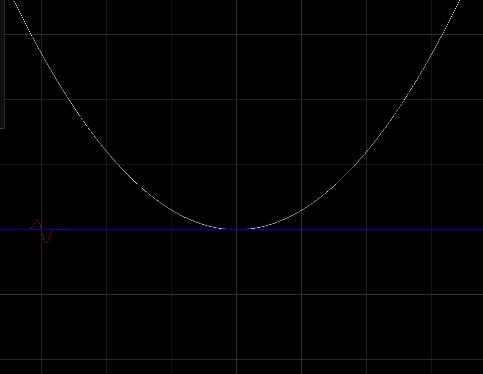

# Schrödinger 1D


FDM, split-step method 1D Schrödinger equation simulation

## Features
* Eigenstates of Potential
* Eigenstate Time Evolution
* Wave packet simulation

## Control
* WASD to move 
* scroll to zoom

## Compilation Instructions:
1. Install requirements
    * Install GLFW, Eigen Library on your system (apt-get, vcpkg...)
2. Setup glad
    * Create a glad folder in your project directory.
    * Download [glad](https://glad.dav1d.de/) and move all the relevant files to the glad folder.
3. Setup ImGui
   * Download ImGui source from the [given link](https://github.com/ocornut/imgui).
   * Add the following files to an imgui folder:

```
imconfig.h      
imgui_draw.cpp          
imgui_impl_opengl2.h         
imgui_internal.h   
imstb_textedit.h
imgui.cpp       
imgui_impl_glfw.cpp     
imgui_impl_opengl3.cpp       
imgui_tables.cpp   
imstb_truetype.h
imgui.h         
imgui_impl_glfw.h       
imgui_impl_opengl3.h         
imgui_widgets.cpp
imgui_demo.cpp  
imgui_impl_opengl2.cpp  
imgui_impl_opengl3_loader.h  
imstb_rectpack.h
```

## Need some help
This project is still a work in progess. If you want to contribute, open issue or contact me.
